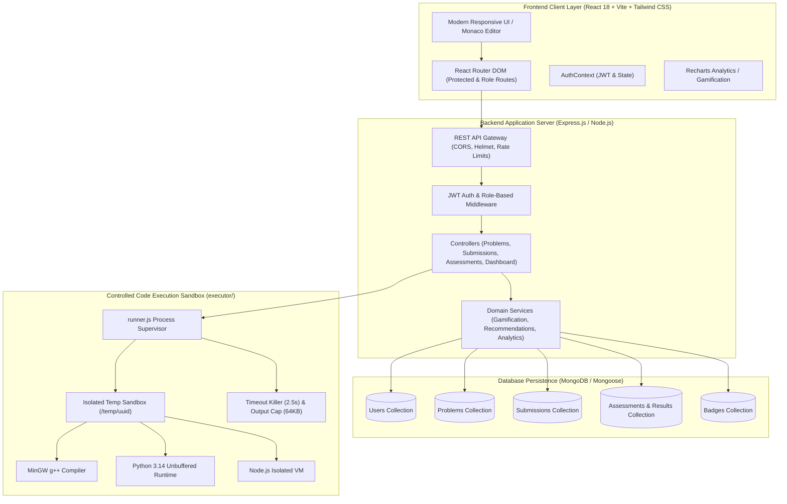
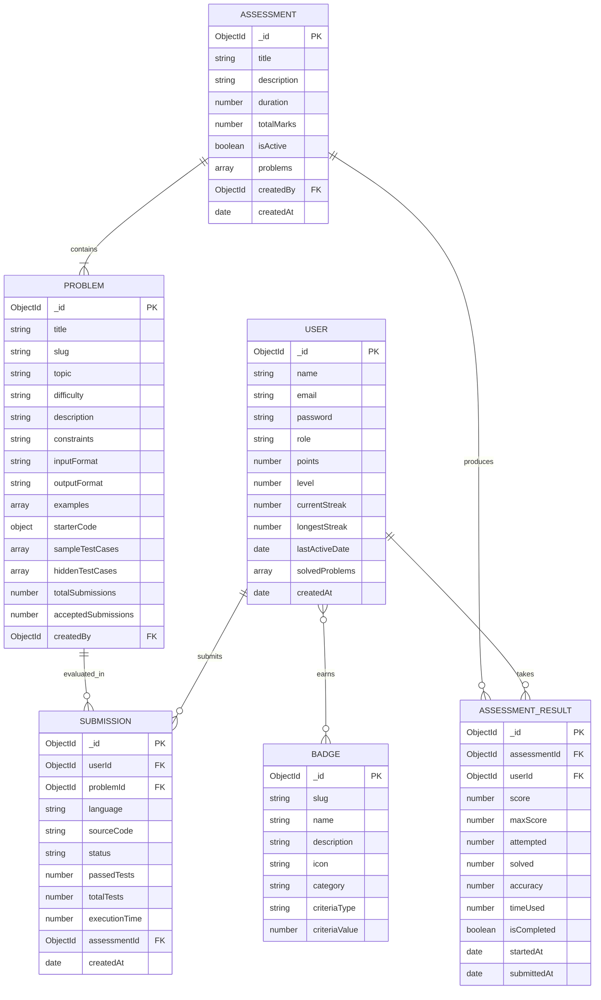
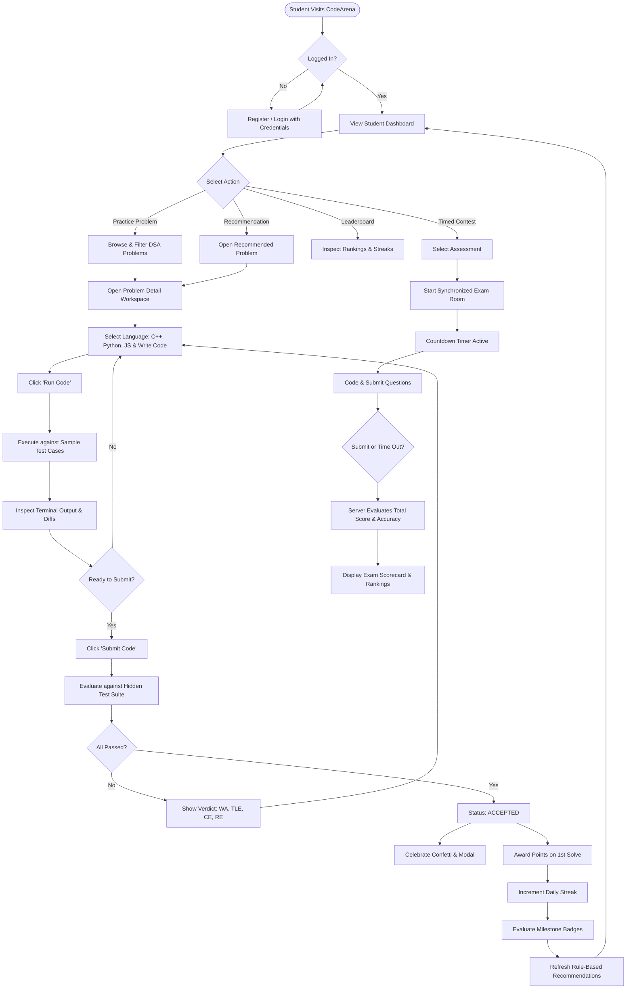
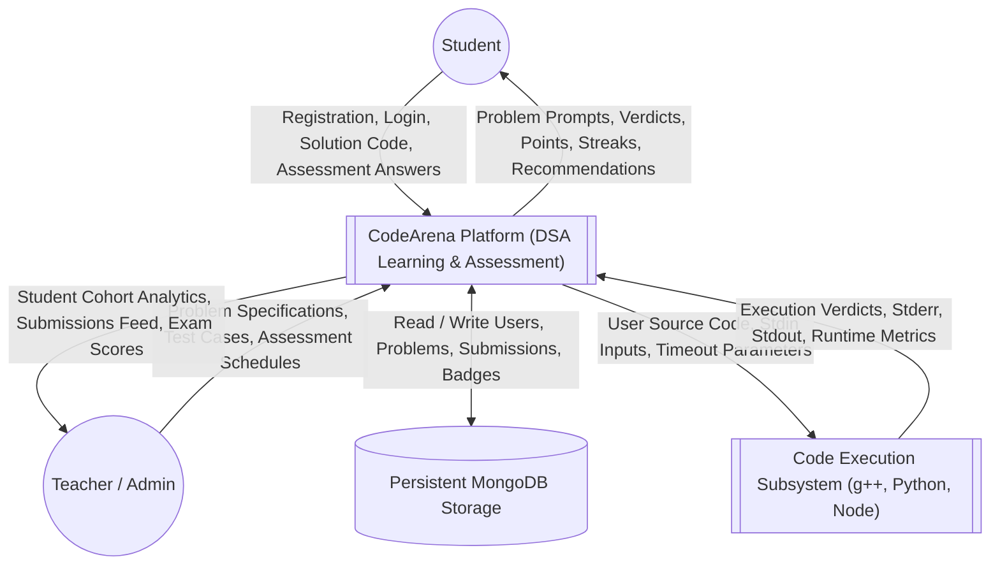
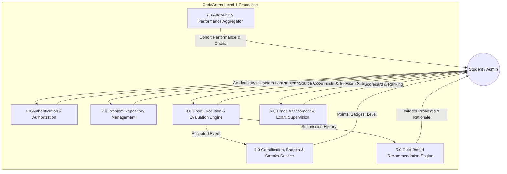
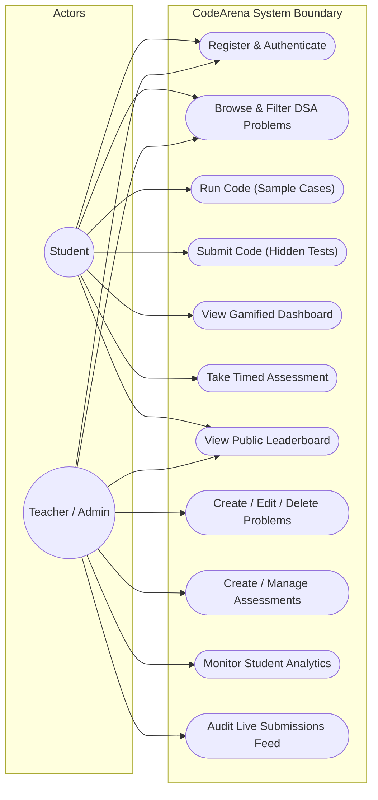
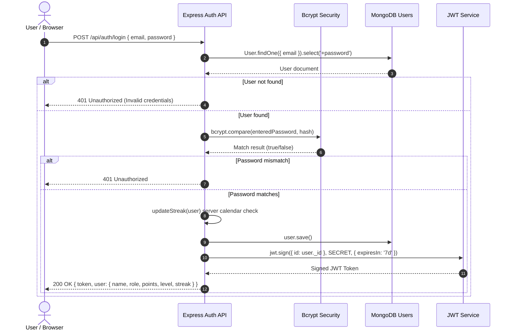
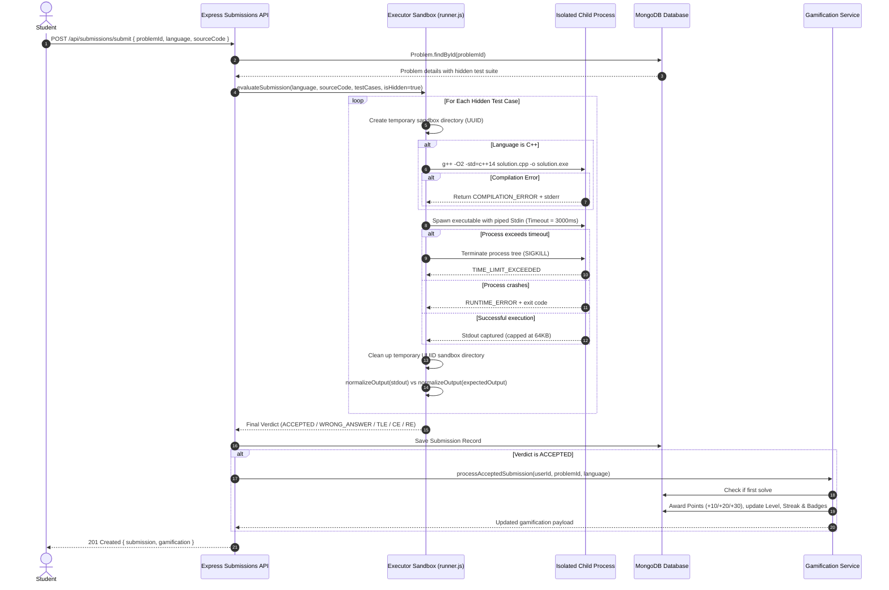

# CodeArena - System Architecture & Visual Diagrams
## CSE Minor Project-I Technical Documentation

---

### 1. System Architecture Diagram

---

### 2. Entity-Relationship (ER) Diagram

---

### 3. Student Workflow Flowchart

---

### 4. Data Flow Diagram - Level 0 (Context Diagram)

---

### 5. Data Flow Diagram - Level 1

---

### 6. Use Case Diagram

---

### 7. Authentication Flowchart

---

### 8. Code Submission & Execution Flowchart

